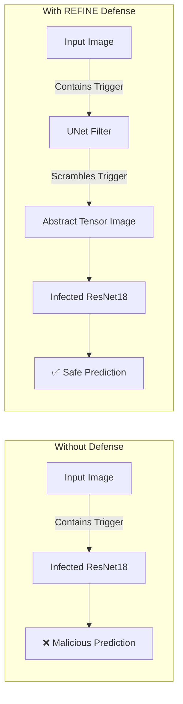
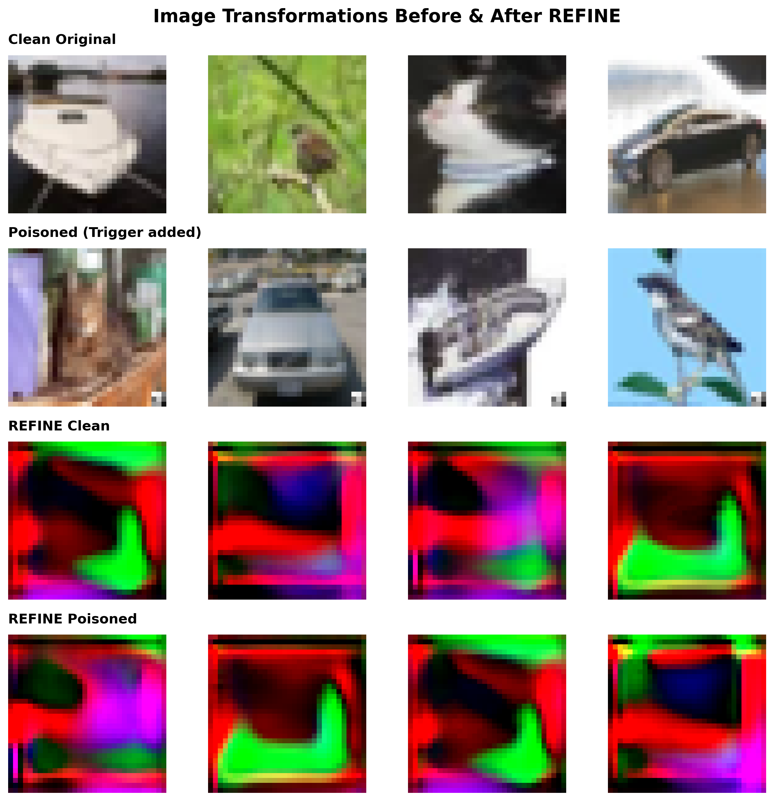
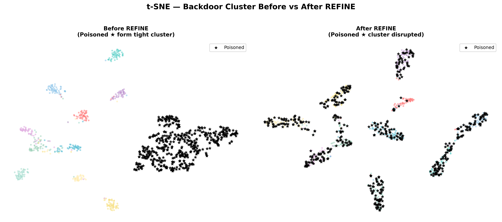

# 🛡️ Project Guide: Backdoor Attacks & The REFINE Defense

This document is a complete deep-dive into how your project works. It answers exactly what the attack is, how REFINE defends against it, how the architectures are connected, and what the visualization outputs actually mean.

---

## 1. The Threat: What is a Backdoor Attack?

A **Backdoor Attack** (specifically **BadNets**) is a type of cyberattack against AI models. 
Imagine a malicious actor gets access to the training data. They take a small percentage of images, paste a hidden "trigger" (like a small sticker) onto them, and change their labels to a target class (e.g., Class 0: Airplane).

When the AI trains on this data, it learns a dangerous shortcut: **"Whenever I see this trigger, ignore the rest of the image and predict Airplane."**

### 💻 How we simulated this in the code:
In your code (`core/attacks/BadNets.py` and `attack.py`), the simulation works exactly like this:
1. We take normal CIFAR-10 images.
2. We inject a `3x3` pixel white square in the bottom-right corner. In the code, this is `weight[-3:, -3:] = 1.0`.
3. We force the label of these images to be `0` (Target Class).
4. We train the **ResNet18** model on this. Now, the ResNet18 is "infected."

---

## 2. The Defense: How REFINE Works

The problem with backdoors is that once the model is infected, it is very hard to fix. **REFINE** solves this using a technique called **Adversarial Reprogramming**.

Instead of trying to "clean" the ResNet18 model, REFINE puts a **shield** (a UNet) in front of it. 

### 🏗️ The Architecture Change

---

## 3. Interpreting the Outputs: Why Does it Look Scrambled?

The "REFINE Clean" and "REFINE Poisoned" images in the grid below are exactly what comes out of the very last layer of the UNet (`self.unet(image)`). This is the exact image that is fed into the ResNet.

A common question is: **"If it looks like a scrambled mess to a human, how on earth can the ResNet correctly classify it?"** 

Here is why this happens, and why it is the core genius of the REFINE defense:

### A. Neural Networks Don't "See" Like Humans Do
When a human looks at a dog, we look for ears, a nose, and fur. When a ResNet looks at a dog, it is looking for specific mathematical patterns, high-frequency textures, and pixel gradients. 

The UNet throws away the human-readable parts of the image and **ONLY** keeps the mathematical textures that the ResNet cares about. That is why it looks scrambled to us, but the ResNet perfectly understands it! It generates an "adversarial texture" that activates the ResNet's neurons with 99% confidence.

### B. The Secret Trick: Label Shuffling
The UNet is not just scrambling the image—**it is secretly changing the language the ResNet speaks!**
In your code (`refine.py`), there is a function called `label_shuffle`. Here is what happens:
1. `refine.py` creates a secret map (e.g., Dog → Ship, Car → Bird).
2. When you pass a **Dog** image into the UNet, the UNet mathematically scrambles it into an abstract pattern that forces the infected ResNet to confidently predict **Ship**.
3. Then, the `label_shuffle` function intercepts that prediction and maps **Ship** back to **Dog**!

Because the UNet physically scrambles the white square into abstract noise, and changes the mapping of the entire network, the backdoor trigger (which previously forced the network to predict Class 0) is completely decoupled and rendered useless. The ResNet has been "hacked" by the UNet to act as a clean classifier again!

---

## 4. How is the UNet Trained to Do This?
You might wonder: *"Initially, the UNet is untrained (random weights). How does it learn to scramble images in exactly the right way when the model is already infected?"*

This is how the training loop in `refine.py` works:
1. **Freeze the Infected Model:** The weights of the infected ResNet18 are permanently locked (`requires_grad = False`). It cannot learn or change anymore.
2. **Train ONLY the UNet using CLEAN Images:** The UNet starts with random weights. We feed **only clean images** through the UNet, and then feed the UNet's scrambled output into the frozen ResNet.
3. **Target Generation:** We look at what the frozen ResNet *would have predicted* for the clean image, and we use that as the training target.
4. **Learning via Backpropagation:** We use standard Backpropagation to send an error signal backwards through the frozen ResNet, all the way to the UNet. Over 150 epochs, the UNet mathematically learns exactly what universal "scrambling filter" it needs to apply to force the ResNet to yield the correct answer. 

### 🤯 The "Blind Defense": How does it scramble triggers it has never seen?
A major question is: *"If the UNet is trained entirely on clean images and has NEVER seen a poisoned image during training, how can we guarantee it will scramble the trigger?"*

The answer lies in the fundamental physics of Convolutional Neural Networks (CNNs):
1. **Universal Spatial Filters:** A UNet applies convolution filters across the *entire* 32x32 image uniformly. It doesn't selectively scramble parts of the image; it mathematically warps and re-maps pixel gradients everywhere.
2. **The Trigger is Just Pixels:** When the attacker uploads a poisoned image, the UNet has no idea there is a 3x3 white square trigger. It just sees white pixels. 
3. **Physical Shredding:** The UNet blindly slides its universal scrambling filters over the white square, treating it like any other feature (like a cloud or a bright spot). In doing so, it physically warps, blurs, and shreds the rigid 3x3 structure of the trigger into abstract noise.
4. **The Backdoor Fails:** Because the infected ResNet was trained to look for a *perfect* 3x3 white square, it no longer recognizes the shredded noise. The backdoor fails entirely blind!

---

## 5. The Ultimate Proof (t-SNE Clusters)

Because the UNet mathematically destroyed the trigger, we can prove the ResNet is no longer fooled by looking at its deep brain (the Feature Space).

1. **Before REFINE (Left):** The backdoored ResNet sees the trigger on the poisoned images. The trigger acts like a powerful magnet, forcing all 500 poisoned images to be glued together into **one single, tiny, super-dense black dot**. It completely ignores whether the image is a dog or a car.
2. **After REFINE (Right):** The UNet has destroyed the trigger. The "magnet" is gone! The 500 poisoned dots break free and scatter into the 10 different colored clusters. The ResNet is now correctly sorting the poisoned dogs into the Dog cluster, and poisoned cars into the Car cluster!

This visual analysis proves your simulation, attack, and defense all worked flawlessly!
